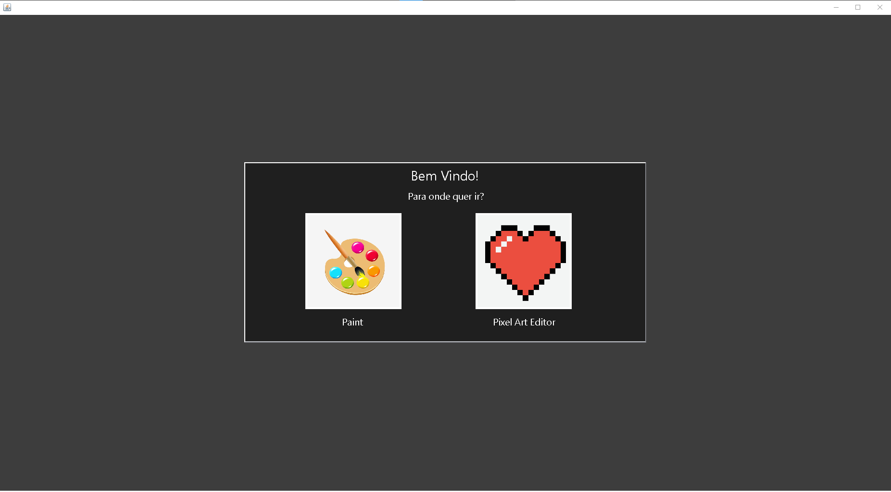
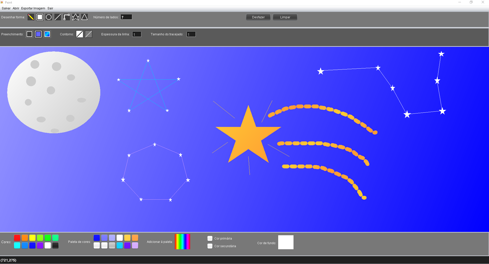
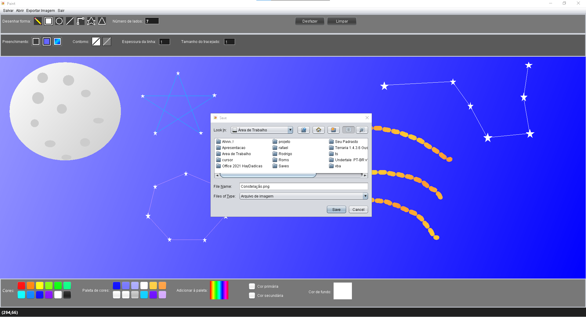
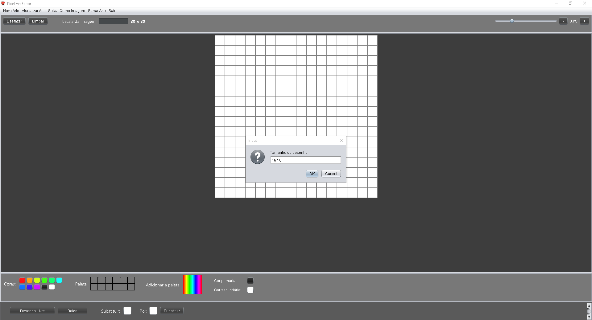
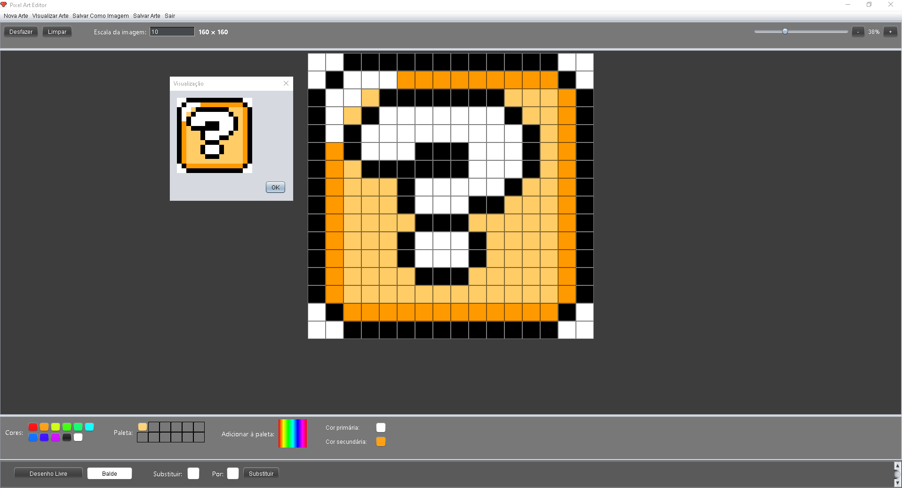

# Paint e Pixel Art Editor

## O que aprendi nesse projeto:
+ Utilizar classas abstratas, herança e polimorfismo para tornar aplicação mais escalável
+ Criação e manipulação de componentes swing e gerenciadores de layout
+ Utilizar interfaces ouvintes de eventos(Listeners) e classes de eventos do pacote java.awt.Event
+ Diversos métodos da classe Graphics e Graphics2D para criação de graficos bidimensionais
+ Criação e manipulação de BufferedImages, utilização da classe ImageIO para leitura e escrita de imagens
+ Leitura e escrita de arquivos e serialização de objetos com java.io e java.nio

# Screenshots

